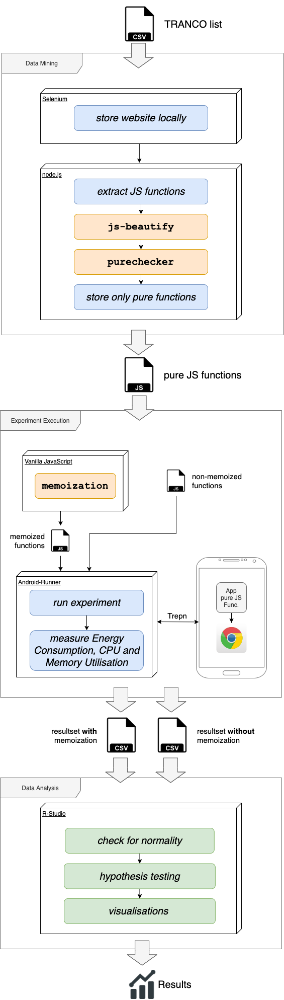

# GoGreen Experiment Replication Package
This repository indends to be the Replication Package for the Green-Lab experiment with the title _What is the impact of memoization on the energy efficiency of mobile web apps?_ which was contucted at the Vrije Universiteit Amsterdam 2020. The actual report is available [here](https://github.com/OdessaR/android-runner/blob/master/documentation/GoGreen_Report.pdf).


## Structure
This Replication Package contains all necessary files and data to reproduce the entire experiment. To achieve this, the repository is based on a fork of [AndroidRunner](https://github.com/S2-group/android-runner) and is extended by all other experiment relevant files. This might lead to a more complex structure, but only by providing all necessary files, a replication is ensured. The repository is structured as follows:

```
    android-runner
     .
     |
     |--- AndroidRunner/    [AndroidRunner] Program core files
     |--- MonkeyPlayer/     [AndroidRunner] Android Record and Replay UI Testing Framework
     |--- documentation/    [All] Figures and PDFs for documentation
     |--- examples/         [AndroidRunner] Example configurations and experiments
     |
     |--- gogreen/          [Data Mining] Files for generating the experiment input data
     |      |
     |      |--- experiment-files/          [Data Mining] Resuls after executing the Data Mining process. Represents the actual experiment input data.
     |      |       |
     |      |       |--- lib/               Contains the memoization library
     |      |       |--- memoizedExec/      HTML files for the memoized experiment
     |      |       |--- normalExec/        HTML files for the non-memoized experiment
     |      |       |--- websites/          Extracted JS functions for the experiment
     |      |
     |      |--- generate.py                Helper file to create the memoized HTML files
     |
     |--- gogreenExperiment/    [Experiment Exectuion] Configuration files for the AndroidRunner and Trepn experiment
     |
     |--- rcode/                [Data Analysis] R-Script and experiment results in raw format
     |      |
     |      |--- data/          [Data Analysis] Experiment results in raw format (ZIP)
     |      |--- stats.r        [Data Analysis] Statistical analysis in R
     |
     |--- selenium/             [Data Mining] Automatically scripts for extracting pure JS functions from the Tranco list
     |
     |--- tests/                [AndroidRunner] Test cases
     |
     |--- <otherFiles>          <mostly relevant for AndroidRunner>
```

## Experiment Architecture

<p align="center">
    
</p>

## Source Code

### Data Mining

### Experiment Execution

### Data Analysis


## Data


## Figures


## Steps to Reproduce